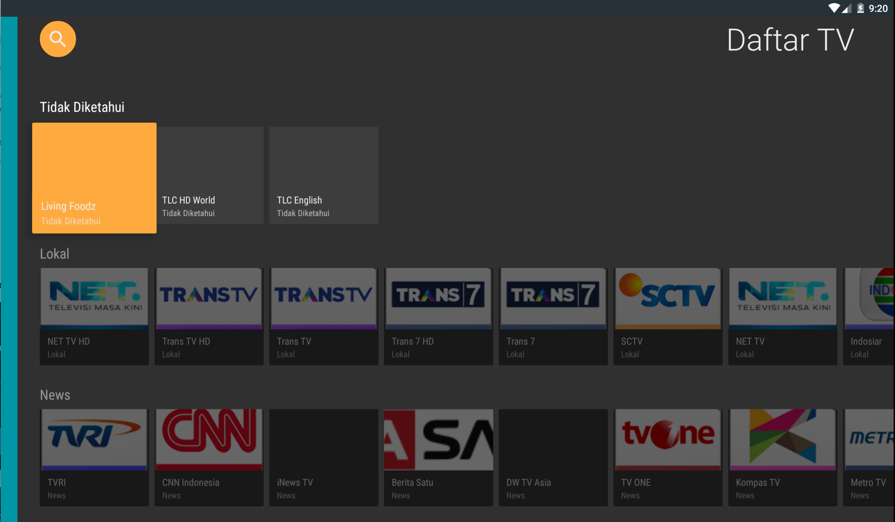
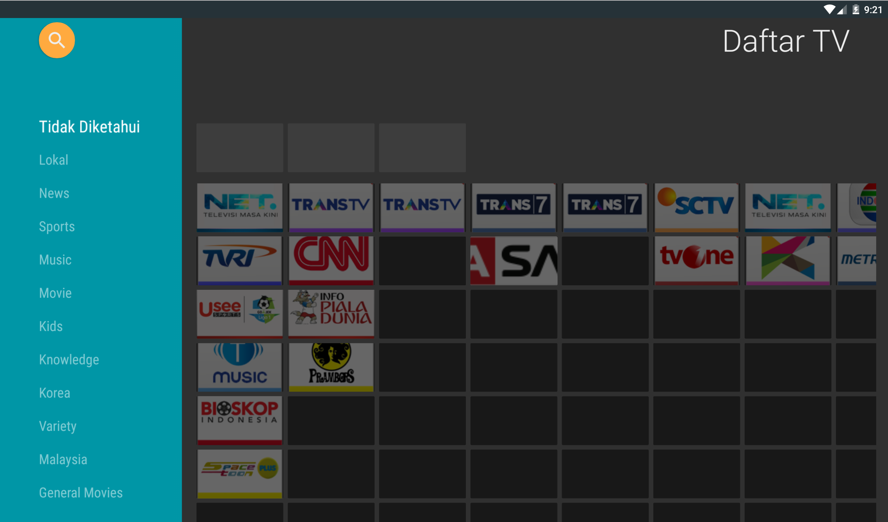

# Set Top Box IPTV for Android TV
Android TV project for live Streaming. With this app we can fetch channels from file (m3u) and show in list. Select channel to play. We can use IR Remote too to navigate between channels.

#### Screenshots

### How to use
Simple clone this repo
`$ git clone https://github.com/athasamid/stbiptv.git`

add m3u file in `tv/src/main/res/raw/` and run 

### Features
- Support M3U playlist
- Support IR Remote (change with number id)
- Parse M3U playlist and save to local db

### Todos & PR
- Fixing bugs remote force close 
- Fixing bugs libVLC cannot find instance
- Add upload m3u from url and local storage

### Libraries
- [Leanback](https://developer.android.com/reference/android/support/v17/leanback/package-summary)
- [vlc-example-streamplayer](https://github.com/pedroSG94/vlc-example-streamplayer)
- [Room Persistence Library For Local Storage](https://developer.android.com/topic/libraries/architecture/room)
- [Glide](https://github.com/bumptech/glide)
- [Google Gson](https://github.com/google/gson)
- [Database Debug](https://github.com/amitshekhariitbhu/Android-Debug-Database)